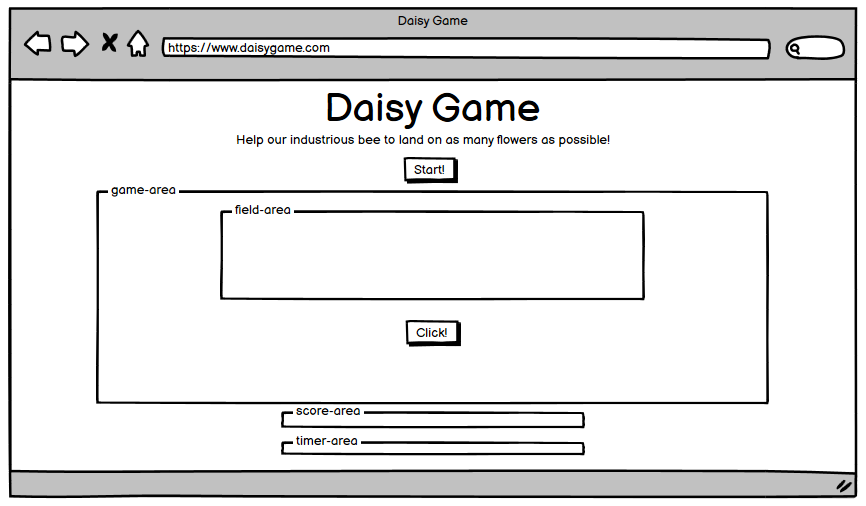

# The Daisy Game

The purpose of this project is to build a front-end site. The site should respond to the users' actions, allowing users to actively engage with data, alter the way the site displays the information to achieve their preferred goals. 
I decided to create an interactive game, where a bee is allowed to land on flowers to collect the pollen. The collision between the bee and the flower will be generating points, shown in the final score at the bottom of the game-area. The game ends after 1 minute, set up with a timer embedded in JavaScript.
This game is developed using HTML, CSS and JavaScript.

## Project Inspiration
The idea comes from one of my past work experiences, when I had the chance to study the bee's behaviour and also theis products from a chemical perspective.
A bee can travel up to 30 Km to find the flowers that it likes most! Let's see how many flowers it will find in 1 minute!

## Wireframe
The preliminary sketch of the website looked like this wireframe:

## Features

### Existing Features

- __Introduction area__

  - This section contains a short introduction on the scope of the game. 
  - It will be asked to the user to help our industrious bee to land on as many flowers as possible, in 1 minute.
  - It also contains a button to start/restart the game.

    

- __Game area__

  - The game area contains a field area and a button that will allow the bee to fly down. 
  - This section has a background image to grab the attention of the users.

    

- __Field area__

  - The fieald area is where the game takes place.
  - This user will see the value of renting the premises, having the opportunity to see he main features that the accommodation will offer. 

    

- __Score area__

  - This section, below the game area, will show the score.
  - It will be visible on the screen all the time.

    

- __Timer area__ 

  - The final section contai a timer, embedded in JavaScript.
  - The timer will count down the seconds, from 60 to 0.
  - The game will end after 60 seconds.

    

### Features Left to Implement

- Add poisonus flowers that will decrease your score if touched by the bee.

## Testing 

- I tested this page in different browsers: Chrome, Edge, Safari.
- The project is responsive, and it looks and works well on different browsers and screen sizes.

### Validator Testing 

- HTML
  - No errors were returned when passing through the official W3C validator:
    - [Daisy Game](https://validator.w3.org/nu/...)

- CSS
  - No errors were found when passing through the official [(Jigsaw) validator](https://jigsaw.w3.org/css-validator/...)

- Accessibility
  - Performance, accessibility and best practices were assessed through Lighthouse in devtools and passed the testing with good scores.
    

### Fixed Bugs

- 
- 
- 

### Unfixed Bugs
None

## Deployment

- The site was deployed to GitHub pages. The steps to deploy are as follows: 
  - In the GitHub repository, navigate to the Settings tab.
  - From the menu, select Pages.
  - From the Branch section drop-down menu, select the Main Branch.
  - Once the main branch has been selected, the page will be automatically refreshed with a detailed ribbon display to indicate the successful deployment. 

  The live link can be found here - [DaisyGame](https://valep314.github.io...)

## Credits  

### Content 

- The main structure and the README file are inspired to the Love Running and Love Maths projects.
- The icon in the heading was taken from [Font Awesome](https://fontawesome.com/)
- Inspiration on the coding for structure of the game came from this video from KnifeCircus [KnifeCircus](https://www.youtube.com/watch?v=bG2BmmYr9NQ)
- [W3 School](https://www.w3schools.com/) was consulted regularly for tips on general coding, as well as [Stack Overflow] (https://stackoverflow.com/).

### Media

- The [Bee photo](./assets/images/bee.png) on the field area is from Pixabay by RalfDesign: https://pixabay.com/images/id-5132049/ and it was slightly modified using Paint.
- The [Daisy photo](./assets/images/daisy.png) on the field area is from Pixabay by OpenClipart-Vectors: https://pixabay.com/images/id-149169/
- The [Background picture](./assets/images/sfondo_api.jpg) on the game area is from Pixabay by Buntysmum: https://pixabay.com/images/id-4971985/

### Disclaimer

The information provided on this site is intended for educational purposes only.
